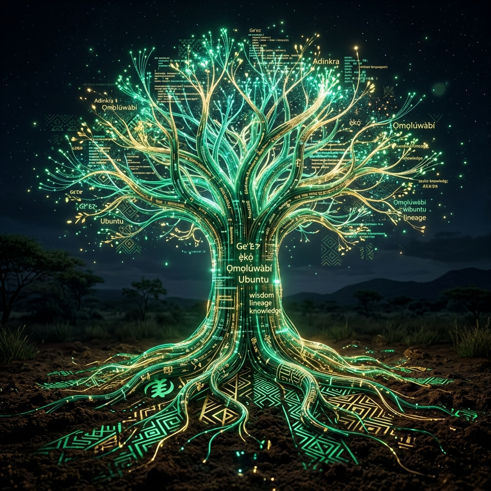

# Rigwe Language Digitalization - Web Presentation

A modern, highly interactive, and visually stunning 11-slide web presentation deck built to showcase the mission, progress, and future of digitalizing the Irigwe language. Built by TechBoost NG HUB.



## 🎯 Project Overview

This presentation was custom-built as a dynamic React application rather than a traditional PowerPoint. It utilizes modern web technologies, "glassmorphism" aesthetics, and interactive components to deliver a powerful message about cultural preservation, AI development, and digital representation for the Rigwe people.

## ✨ Key Features

- **11 Custom Slides**: Covering everything from the "Big Vision" to "Data Collection Standards" and a detailed "Project Roadmap".
- **Glassmorphism UI**: Beautiful semi-transparent, glowing, and frosted-glass interfaces powered by Tailwind CSS.
- **Interactive Navigation**: 
  - **Keyboard Support**: Use `ArrowLeft`, `ArrowRight`, and `Spacebar` to navigate.
  - **Fullscreen Mode**: Press `F` or use the UI button for a distraction-free presentation.
  - **Sidebar Menu**: Quick-jump to any specific slide using the toggleable sidebar.
- **Dynamic Content**: Features an auto-rotating image carousel demonstrating the live "Phoneme Explorer" dashboard.
- **Fully Responsive**: Adapts seamlessly to laptops, projectors, and mobile devices.

## 🛠️ Technology Stack

- **Framework**: React 18
- **Build Tool**: Vite
- **Styling**: Tailwind CSS v4
- **Icons**: Lucide React
- **Typography**: Google Fonts (Space Grotesk, Inter, Outfit)

## 🚀 Getting Started

### Prerequisites
Make sure you have [Node.js](https://nodejs.org/) installed on your machine.

### Installation

1. Navigate to the project directory:
```bash
cd FirstPresentationRigwe
```

2. Install the dependencies:
```bash
npm install
```

3. Start the development server:
```bash
npm run dev
```
The presentation will run locally at `http://localhost:5173`.

### Building for Production

To compile the presentation into static files for deployment (e.g., GitHub Pages, Vercel, Netlify):

```bash
npm run build
```

This will generate an optimized `dist/` folder containing your production-ready application.

## 📁 Project Structure

All slide logic is modularized in the `src/components/` directory:
- `Slide1Cover.jsx` - Title and introductory info
- `Slide2Presenter.jsx` - Presenter bio (Daniel Turu)
- `Slide3Welcome.jsx` - Why this project matters
- `Slide4Vision.jsx` - The Big Vision & AI Goals
- `Slide5Progress.jsx` - Phoneme Dashboard Carousel
- `Slide6AILearning.jsx` - How AI Learns from Data
- `Slide7DataPhases.jsx` - Data Collection Phases
- `Slide8DataStandards.jsx` - Quality Guidelines
- `Slide9Roadmap.jsx` - 4-Month Development Plan
- `Slide10Future.jsx` - Global Opportunities
- `Slide11ThankYou.jsx` - Closing statements

## 🤝 Brought to you by

**Daniel Turu**  
CEO, TechBoost NG HUB  
*Digitalizing Plateau State Languages*
